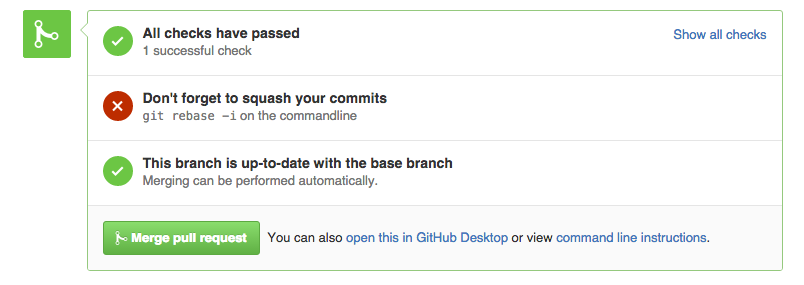

# Squash Reminder

Squash Reminder is a Chrome extension that reminds you to squash the commits in your pull requests before merging on GitHub.

## Installation

1. Clone the repository: `git clone https://github.com/mk12/squash-reminder.git`.
2. Navigate to chrome://extensions in your browser.
3. Click the checkbox to enable developer mode.
4. Choose "Load unpacked extension..."
5. Select the repository directory `squash-reminder`.

## Usage

Visit an open pull request on GitHub that has more than one commit associated with it. If you can automatically merge the pull request, then Squash Reminder will insert a little reminder at the bottom of the page:

## License

© 2015 Mitchell Kember

Squash Reminder is available under the MIT License; see [LICENSE](LICENSE.md) for details.